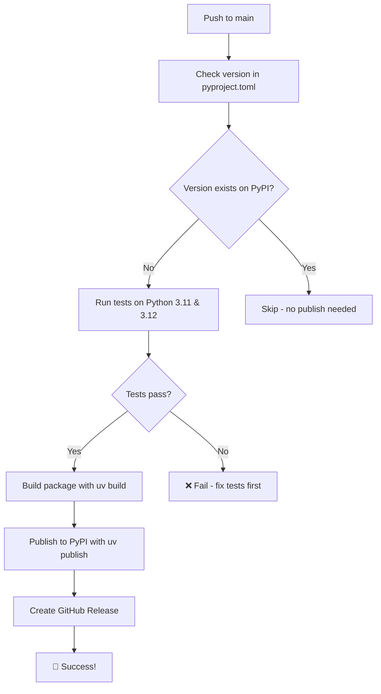

# CI/CD Setup Guide for mcp-tts

This guide will help you set up automated publishing to PyPI using GitHub Actions and `uv publish`.

## 🚀 Quick Setup

### 1. **Get a PyPI API Token**

1. Go to [PyPI Account Settings](https://pypi.org/manage/account/token/)
2. Click "Add API token"
3. **Name**: `mcp-tts-github-actions`
4. **Scope**: Select "Project: mcp-tts" (if this is your first publish, you'll need to create the project manually first)
5. Copy the token (starts with `pypi-`)

### 2. **Set up GitHub Repository Secrets**

1. Go to your GitHub repository
2. Navigate to **Settings** → **Secrets and variables** → **Actions**
3. Click **"New repository secret"**
4. **Name**: `PYPI_API_TOKEN`
5. **Value**: Paste your PyPI API token
6. Click **"Add secret"**

### 3. **Create PyPI Environment (Recommended)**

1. In your GitHub repository, go to **Settings** → **Environments**
2. Click **"New environment"**
3. **Name**: `pypi`
4. **Protection rules** (optional but recommended):
   - ✅ **Required reviewers**: Add yourself
   - ✅ **Wait timer**: 5 minutes (gives you time to cancel if needed)
5. Click **"Configure environment"**
6. Add environment secret:
   - **Name**: `PYPI_API_TOKEN`
   - **Value**: Your PyPI API token

## 📋 How It Works

### **Automatic Publishing Workflow**



### **When Publishing Happens**

- ✅ **Push to main** with a **new version** in `pyproject.toml`
- ✅ **Manual trigger** via GitHub Actions UI
- ❌ **NOT on pull requests** (only testing)
- ❌ **NOT if version already exists** on PyPI

### **What Gets Tested**

- 🔍 **Code linting** (ruff)
- 🎨 **Code formatting** (black)
- 📦 **Package building** (uv build)
- 🧪 **Import tests** (basic functionality)
- 🐍 **Multiple Python versions** (3.11, 3.12)

## 🔄 Publishing a New Version

### **Method 1: Manual Version Bump**

1. **Edit `pyproject.toml`**:
   ```toml
   [project]
   name = "mcp-tts"
   version = "0.3.0"  # ← Change this
   ```

2. **Commit and push**:
   ```bash
   git add pyproject.toml
   git commit -m "🚀 Bump version to 0.3.0"
   git push origin main
   ```

3. **Watch the action**: Go to **Actions** tab in GitHub

### **Method 2: Using the Version Bump Script**

```bash
# Bump patch version (0.2.0 → 0.2.1)
uv run python scripts/bump_version.py patch

# Bump minor version (0.2.0 → 0.3.0)  
uv run python scripts/bump_version.py minor

# Bump major version (0.2.0 → 1.0.0)
uv run python scripts/bump_version.py major

# Custom version
uv run python scripts/bump_version.py 0.5.0
```

**The script will:**
- ✅ Check current version
- ✅ Calculate new version
- ✅ Ask for confirmation
- ✅ Update `pyproject.toml`
- ✅ Create git commit
- ✅ Provide next steps

## 🛠️ First-Time Setup Checklist

### **Before Your First Auto-Publish**

- [ ] **Create PyPI project manually** (if this is your first publish):
  ```bash
  # Build and publish manually once
  uv build
  uv publish
  ```
  
- [ ] **Test the workflow**:
  1. Make a small change
  2. Bump version to something like `0.2.1-test`
  3. Push and watch the action run
  4. Verify it publishes correctly
  5. Users can install: `uvx --from mcp-tts@0.2.1-test mcp-tts-server-stdio`

### **Repository Settings**

- [ ] **Enable Actions**: **Settings** → **Actions** → **General** → Allow all actions
- [ ] **Branch Protection** (optional): **Settings** → **Branches** → Add rule for `main`
  - ✅ Require status checks to pass
  - ✅ Require `Test and Lint` workflow

## 🔍 Monitoring and Troubleshooting

### **Check Workflow Status**

1. **GitHub Actions tab**: See all workflow runs
2. **Package status**: Check [PyPI mcp-tts page](https://pypi.org/project/mcp-tts/)
3. **Installation test**: `uvx --from mcp-tts mcp-tts-server-stdio`

### **Common Issues**

| Problem | Solution |
|---------|----------|
| **"Version already exists"** | Bump version in `pyproject.toml` |
| **"Invalid PyPI token"** | Update `PYPI_API_TOKEN` secret |
| **"Tests failing"** | Fix linting/format issues locally first |
| **"Permission denied"** | Check environment protection rules |
| **"Package not found"** | Ensure package name matches PyPI exactly |

### **Local Testing Commands**

```bash
# Test everything locally before pushing
uv run ruff check .
uv run black --check .
uv build
uv run python -c "import sys; sys.path.insert(0, 'src'); from config import Config; print('✅ OK')"

# Test install from built package
cd dist && uv pip install --force-reinstall mcp_tts-*.whl
```

## 🔐 Security Notes

### **Secret Management**

- ✅ **PyPI tokens** are stored as GitHub secrets (encrypted)
- ✅ **Environment protection** prevents accidental publishes
- ✅ **Scoped tokens** limit access to just your package
- ✅ **No secrets in code** - all handled by GitHub

### **Best Practices**

- 🔄 **Rotate PyPI tokens** periodically
- 👥 **Limit environment access** to trusted collaborators
- 📋 **Review workflow runs** before approving environment deploys
- 🏷️ **Use semantic versioning** (major.minor.patch)

## 🎯 Next Steps

1. **Test the setup** with a small version bump
2. **Set up branch protection** rules for main
3. **Add more comprehensive tests** as your project grows
4. **Consider pre-release versions** for testing (e.g., `0.3.0-rc1`)

---

**📚 Additional Resources:**
- [PyPI Publishing Guide](https://packaging.python.org/en/latest/guides/publishing-package-distribution-releases-using-github-actions-ci-cd-workflows/)
- [UV Documentation](https://docs.astral.sh/uv/)
- [GitHub Actions Documentation](https://docs.github.com/en/actions) 